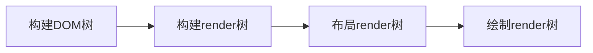

# 浏览器渲染原理


[TOC]

## 00 资料

https://kb.cnblogs.com/page/129756/

https://taligarsiel.com/Projects/howbrowserswork1.htm

https://developer.chrome.com/blog/inside-browser-part1/

https://developer.chrome.com/blog/inside-browser-part2/

https://developer.chrome.com/blog/inside-browser-part3/

https://developer.chrome.com/blog/inside-browser-part4/

https://developer.chrome.com/docs/devtools/

## 01 渲染页面机制和原理

### DOM是什么?

+ 文档对象模型 (DOM) 是 HTML 和 XML 文档的编程接口。它提供了对文档的结构化的表述，并定义了一种方式可以使从程序中对该结构进行访问，从而改变文档的结构，样式和内容。DOM 将文档解析为一个由节点和对象（包含属性和方法的对象）组成的结构集合。简言之，它会将 web 页面和脚本或程序语言连接起来。
+ 

### 渲染过程


1.解析HTML，生成DOM树，解析CSS，生成CSSOM树

2.将DOM树和CSSDOM树结合，生成渲染树（Render Tree）

3.Layout：根据生成的渲染树，计算它们在设备视口内的确切位置和大小

4.Painting：根据渲染树以及回流得到的几何信息，得到节点的绝对像素

5.Display：将像素发送给GPU，展示在页面上


## 02 浏览器主要组成


### 2.1 Rendering engine

| 浏览器  | 渲染引擎 | JavaScript引擎 |
| :-----: | :------: | :------------: |
| Firefox |  Gecko   |  SpiderMonkey  |
| Chrome  |  Webkit  |       V8       |
| Safari  |  Webkit  | JavaScriptCore |


渲染主流程：



（1）解析Parsing

解析一个文档即将其转换为具有一定意义的结构——编码可以理解和使用的东西，结果通常是表达文档的节点树。

（2）HTML parser

HTML不能使用常规的自顶向下或自底向上解析器进行解析

（3）CSS parser

CSS字节转换成字符，接着转换成令牌和节点，最后挂靠到一个称为CSS对象模型CSSOM的树结构内。

（4）Attachment

在Webkit中，解析样式并创建渲染器的过程被称为“attachment”

### 2.2 Render Tree的构造

render tree： 这个树是按照视觉元素显示的顺序排列的。它是文档的可视化表示。这个树的目的是使内容能够按照正确的顺序绘制。渲染器对应于DOM元素，但关系不是一一对应的。非可视化的DOM元素不会被插入到渲染树中。

(1) Style Computation

难点：

1. 样式数据是一个非常大的结构，包含许多样式属性，这可能会导致内存问题；
2. 如果没有优化，为每个元素查找匹配规则可能会导致性能问题；
3. 应用这些规则涉及到相当复杂的级联规则，这些规则定义了规则的层次结构。

浏览器解决方法：

1. sharing style data（共享样式数据）
2. manipulating the rules for an easy match（对规则进行处理以简化匹配过程）
3. applying the rules in the correct cascade order（以正确的级联顺序应用规则）

### 2.3 Layout

1. HTML使用基于流的布局模式，可以以单一途径进行几何计算。流中靠后的元素并不会影响前面元素的几何特性。

2. dirty bit系统

   一个渲染对象发生变化或是被添加，就标记它及它的children为dirty，需要layout

3. 全局和增量layout

   全局：layout在整棵渲染树触发时；

   + 一个全局的样式改变影响所有的渲染对象；
   + 窗口resize。

   增量：只有标志为dirty的渲染对象会重新布局，异步触发

### 2.4 painting

1. 绘制阶段，遍历渲染树并调用渲染对象的paint方法将内容显示在屏幕上，使用UI。
2. 全局和增量绘制
   + 全局：绘制完整的树
   + 增量：某个渲染对象重绘

### 2.5 渲染引擎线程

渲染引擎单线程，除网络操作外，几乎所有的事情都在单一线程中处理。

### 2.6 事件循环（JS执行机制）

+ 事件循环：在JS引擎等待任务，执行任务和进入休眠状态等待更多任务这几个状态之间转换的无限循环。

首先判断JS是同步还是异步，同步就进入主线程，异步进入Event Table并注册函数，当满足触发条件后，Event Table会将这个函数移入Event Queue（事件队列）。当主线程内的任务执行完毕为空，会去Event Queue查看是否有可执行的异步任务，若有就推入主线程中。

+ 宏任务：常见的定时器，用户交互事件
+ 微任务：promise相关任务，MutationObserver等

**微任务永远比宏任务先执行**，每个宏任务之后，引擎会立即执行微任务队列中的所有任务，然后再执行其他的宏任务，或渲染，或进行其他任何操作

```javascript
setTimeout(_ => console.log(4))

new Promise(resolve => {
  resolve()
  console.log(1)
}).then(_ => {
  console.log(3)
})

console.log(2)

```

*输出1234*

## 03 DOM的重绘和回流Repaint & Reflow

### 3.1 重绘

  元素样式改变，但宽高、大小、位置等不变

### 3.2 回流

  元素大小或者位置发生了变化（当页面布局和几何信息发生变化时），触发了重新布局，导致渲染树重新计算布局和渲染。

## 04 浏览器对象

### 4.1 window对象

指当前浏览器窗口，也是当前页面的顶层对象，所有其他对象都是它的下属。

<a href="https://wangdoc.com/javascript/bom/window.html">window对象属性</a>

### 4.2 LocalStorage、sessionStorage、IndexedDB、Cookies对比

**什么时候需要用到本地存储？**

​    保存重要页面的重要数据典型，比如一些需要提交的表单状态，可以在提交之前保存，当用户刷新页面时可以还原静态资源。

|          类别           |                             特点                             |                             局限                             |
| :---------------------: | :----------------------------------------------------------: | :----------------------------------------------------------: |
|      localStorage       | 客户端浏览器本地化存储机制，键值对存储，只读，不会将自动数据发送给服务器，**持久化存储**；网络状态不佳时仍可显示离线数据 | 存储内容过多会导致页面卡；由于数据持久有限且容易读取，安全性差；同步执行，阻塞UI。 |
|     sessionStorage      | 客户端浏览器本地化存储机制，键值对存储，数据仅在**当前会话周期内有效，会话结束后销毁**。适合作为会话周期内事件及页面全局通信的临时性使用的数据存储方式。 |               不能存储长期使用的静态资源数据。               |
|        IndexedDB        | 支持数据读写时的异步操作；存储空间大（250MB以上）适用于客户端存储大容量数据；键值对存储；同源限制（不能跨域访问）；**存储时间永久** |                   操作复杂，需要数据库知识                   |
| Cookies（非浏览器对象） | 客户端文本文件中存储，会话cookie浏览器关闭即删除，持久cookie设置过期时间删除。 | 每次请求自动发送导致CSRF攻击的安全风险；存储量小（4KB）；保存信息容易被窃取 |

应用场景：

+ localStorage：存储一些需要刷新保存并需要在页面关闭后仍留下的信息；保存购物车的内容；保存上一次用户浏览标签，并跳转到相应路径下。
+ sessionStorage：存储一些当前页面刷新且不需要在标签关闭时留下的信息；用来检测用户是否刷新进入的页面，如播放器恢复进度条功能；敏感账号一次性登录。
+ indexedDB：存储大量结构化数据
+ cookie：短期登录；跨站标记用户与跟踪用户行为，在某个用户访问不同页面时，广告商也知道是同一个用户在访问，实现后续商品推荐等。

### 4.3 window的其他对象

（1） location：包含当前URL的信息；

（2）history：包含用户在浏览器窗口中访问过的URL；

（3）document：每个载入浏览器的HTML文档都会成为Document对象，提供脚本中对HTML页面所有元素访问的接口；

（4）Clipboard：实现剪切、复制、粘贴功能；

（5）Event：所有事件对象均基于Event对象，并继承其所有属性和方法；

（6）Animation：表示一个单个动画播放器并且提供用于一个动画节点或源的回放控制和一个时间辅助；

（7）Notification：用于向用户配置和显示桌面通知

## 05 前端性能优化

+ 避免DOM的回流，放弃传统操作dom的时代，基于vue/react开始数据影响视图模式
+ 分离读写操作
+ 样式集中改变
+ 缓存布局信息
+ 元素批量处理 （文档碎片）
+ 动画效果应用到position属性为absolute或fixed
+ CSS3硬件加速（GPU加速规避回流）
+ 牺牲平滑度换取速度
+ 避免table布局和使用css的js表达式


